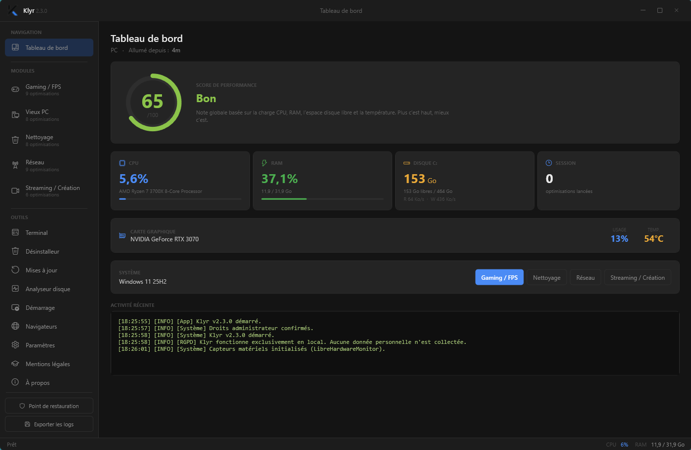

<div align="center">

# Klyr

**Optimiseur PC Windows — 34 optimisations en 4 modules, 100% local, sans télémétrie.**



[](https://www.microsoft.com/windows)
[](https://dotnet.microsoft.com/)
[](LICENSE.txt)
[](https://discord.com/invite/nPWU9cW3NG)
[](#)

</div>

---

## Pourquoi Klyr

Windows accumule au fil des mois des paramètres lourds, des services inutiles, de la télémétrie et des optimisations désactivées par défaut. Klyr regroupe **34 ajustements** validés en 4 modules, sans installer 50 utilitaires séparés et sans envoyer une seule donnée sur internet.

- ⚡ **Mesurable** : +377 points 3DMark mesurés après le module Gaming
- 🔒 **100% local** : aucune télémétrie, aucun tracking, aucun compte
- ↩️ **Réversible** : point de restauration automatique + backups ciblés des fichiers système
- 📖 **Open-source** : tu peux lire chaque ligne avant d'installer

---

## Installation

1. Télécharger la dernière release depuis [Releases](../../releases) → **`Klyr_Setup_v2.1.0.exe`**
2. Lancer l'installeur
3. L'app s'installe dans `C:\Program Files\Klyr` et un raccourci apparaît sur le Bureau

L'installeur intègre le runtime **.NET 10** — aucun prérequis sur la machine cible.

### Note SmartScreen

Klyr n'est pas signée avec un certificat EV. Windows SmartScreen peut afficher :

> *« Windows a protégé votre PC »*

C'est normal pour toute app non signée. Pour continuer :

1. Clic sur **« Informations complémentaires »**
2. Clic sur **« Exécuter quand même »**

Si Defender bloque le téléchargement : ajoute le dossier de téléchargement aux exclusions, ou télécharge à nouveau.

---

## Modules

| Module | Nb | Points clés |
|---|---|---|
| **Gaming / FPS** | 9 | Mode haute perf, désactivation Game DVR, déblocage FPS, latence TCP, fermeture processus parasites |
| **Vieux PC** | 8 | Désactivation services lourds, télémétrie, animations, nettoyage RAM Win32, defrag SSD/HDD intelligent |
| **Nettoyage** | 8 | Disk cleanup, suppression bloatware, SFC/DISM, scan Defender intégré, vidage caches |
| **Réseau** | 9 | Reset Winsock/TCP, DNS auto-bench, optimisation ping, test vitesse, blocage télémétrie hosts |

Les optimisations marquées **« Avancé »** (gain incertain ou risque de régression) sont masquées par défaut. Active-les dans Paramètres si tu veux pousser plus loin.

---

## Privacy & Sécurité

Klyr ne fait **aucun appel réseau** sauf :
- Test de vitesse internet (ping `1.1.1.1` sur demande utilisateur)
- Benchmark DNS (test de résolution `github.com`, `microsoft.com`, `cloudflare.com`)

**Aucune donnée n'est jamais envoyée nulle part.** Pas d'analytics, pas de tracking, pas de compte.

### Backups automatiques avant ops critiques

| Action | Backup créé |
|---|---|
| `net_reset` (reset Winsock/TCP) | `Documents\Klyr\Backups\Network\` |
| `net_reset_firewall` | Export règles pare-feu via `netsh advfirewall export` |
| `net_telemetry_block` (édition hosts) | Copie `hosts` daté |
| `clean_event_logs` | Export `.evtx` avant clear |

Plus une option de **point de restauration système** automatique avant chaque optimisation admin (configurable dans Paramètres).

---

## Tu as trouvé un bug ?

Klyr embarque deux outils diagnostic dans la fenêtre `À propos` :

### Copier infos système
Copie un bloc markdown dans le presse-papier, à coller dans une [GitHub Issue](../../issues) :
```
**Klyr v2.1.0**
- OS : Windows 11 25H2
- CPU : AMD Ryzen 5 9600X
- RAM : 7.4 / 31.1 Go (24%)
- Disque C: : 765 / 930 Go libres
- Architecture : x64
- Admin : oui
```

### Exporter rapport
Génère un `.zip` dans `Documents\Klyr\Reports\` contenant :
- `system_info.txt` diagnostic complet (OS, CPU, RAM, settings, .NET version)
- `settings.json` tes paramètres
- `logs/` tous les logs persistants
- `terminal_session.txt` tampon terminal de la session

Joins ce zip à ton bug report tu n'as rien d'autre à écrire que la description du problème, le diagnostic suffit.

**Privacy** : aucune donnée personnelle dans le zip. Tu peux l'ouvrir avant de l'envoyer pour vérifier.

---

## Résultats mesurés

| Config testée | Avant | Après | Gain |
|---|---|---|---|
| Ryzen 5 9600X, RTX 5060 TI 16Gb (Full optimisation Gaming) | 3DMark 14681 | 3DMark 15058 | **+377 pts** |

> Les gains varient selon la configuration. Plus la base est non-optimisée, plus la marge est élevée.
> Les optimisations marquées « Avancé » peuvent dégrader certains setups utilise les avec discernement.

---

## Architecture

```
Klyr/
├── Klyr.sln                          Solution Visual Studio
├── Klyr.csproj                       Cible .NET 10 / WPF / x64
├── App.xaml / App.xaml.cs            Resources globales + ErrorHandler init
├── app.manifest                      UAC asInvoker + DPI PerMonitorV2
│
├── README.md                         Cette page
├── CHANGELOG.md                      Historique des versions
├── SECURITY.md                       Politique de signalement de vulnérabilité
├── LICENSE.txt                       Conditions d'utilisation
├── .gitignore  /  .gitattributes
│
├── .github/
│   ├── ISSUE_TEMPLATE/               Templates bug_report + feature_request + config.yml
│   └── copilot-instructions.md       Hints GitHub Copilot
│
├── Assets/
│   ├── Icons/icon.ico                Icône multi-résolution (16/24/32/48/64/128/256)
│   └── Branding/                     Mark + wordmark SVG + PNG export + screenshot
│
├── Commands/                         RelayCommand + AsyncRelayCommand
├── Models/                           OptimizationItem, SystemInfoModel
├── Services/
│   ├── SystemService                 P/Invoke Win32, runner CMD/PowerShell, restore points
│   ├── LogService                    Buffer circulaire 2000 entrées + auto-save fichier
│   ├── SettingsService               Persistance JSON dans %AppData%\Klyr
│   ├── ThemeService                  Bascule Dark/Light dynamique (45 brushes)
│   ├── DiagnosticService             Génération diagnostic + export zip
│   ├── ErrorHandler                  Crash handler global + crash reports persistants
│   ├── AdminChecker                  WindowsPrincipal — vérif droits admin
│   ├── ProgressHelper                Animation de progression durant exécution
│   ├── OptimizationBenchmarkService  Capture snapshots CPU/RAM/disque avant/après
│   ├── OptimizationProfileService    Métadonnées des optimisations (confidence, etc.)
│   ├── GamingOptimizations           Module 1 (9 optimisations)
│   ├── OldPcOptimizations            Module 2 (8)
│   ├── CleaningOptimizations         Module 3 (8)
│   └── NetworkOptimizations          Module 4 (9)
│
├── Styles/                           Icons.xaml (Segoe Fluent Icons) + Animations.xaml
├── ViewModels/                       MainViewModel (IDisposable, navigation cache, run all)
├── Views/                            MainWindow, SplashScreen, Settings, About, Legal
└── Installer/                        BUILD_INSTALLER.bat + script Klyr_Setup.nsi
```

---

## Liens

- [CHANGELOG.md](CHANGELOG.md) — historique des versions
- [SECURITY.md](SECURITY.md) — politique de signalement de vulnérabilité
- [LICENSE.txt](LICENSE.txt) — conditions d'utilisation

---

<div align="center">

**Klyr** — Édité par **InfoZen** — 2026

</div>
